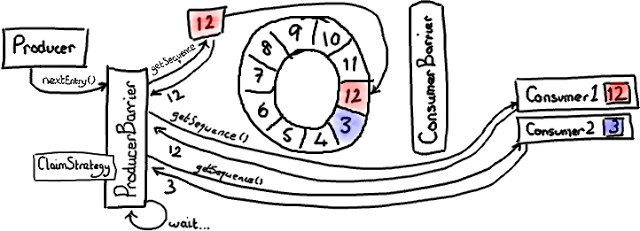
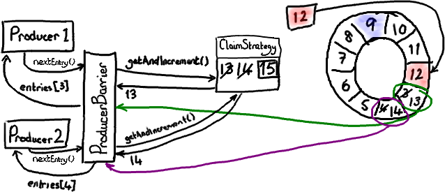

### ringbuffer

底层使用数组，数组预先定义好，可以避免频繁垃圾回收

通过名为cursor的sequence指定队列头

只有一个指针表示当前消费下标，消费到数组最后，再重新开始，才去覆盖方式

##

## Sequencer

- SingleProducerSequencer
    单生产者

- MultiProducerSequencer
    多线程写入时使用

## sequenceBarrier

消费者使用时间处理器序号屏障

屏障会等待当前序列号为期望序列号后进行数据处理

## Sequence 序列号

递增序列号，通过cas操作，线程安全，并且使用padding避免伪共享，使用引用

注： sequence序列号是一直递增的，通过算法计算出对应ringbuffer下标值

## producerBarriers

producerBarrier用于提交生产者写入的entity

写入时需要通过ConsumerTrackingProducerBarrier 判断当前消费者消费下标

上图为一个生产者写入ringbuffer

多生产者写入 通过ClaimStrategy确定当前生产者是否可以写入

## 单消费者

消费者使用EventHandler

    - 写入顺序

        多线程写操作

        每个线程会获取对应next，当前线程会等待cursor变为期望cursor执行写入操作，从而保证写操作与提交顺序无关，而与抢占的位置的先后顺序有关，抢在靠前顺序的一定会先写入。

        写操作保证是原子的，事务及无锁。

## 多生产者多消费者

 消费者的整体逻辑：多个消费者共同使用同一个Sequence即workSequence，大家都从这个sequence里取得序列号，通过CAS保证线程安全，然后每个消费者拿到序列号nextSequence后去和RingBuffer的cursor比较，即生产者生产到的最大序列号比较，如果自己要取的序号还没有被生产者生产出来，则等待生产者生成出来后再从RingBuffer中取数据，处理数据

消费者使用workHandler，监听委托给线程池

屏障
workpool

根据每个WorkHandler创建对应的WorkProcessor，同一个workpool中的消费者线程共享同一个sequenceBarrier,workSequence，

    WorkerPool<T> workerPool = new WorkerPool<T>(
            ringBuffer,
            sequenceBarrier,
            new EventExceptionHandler(),
            consumers);

## 参考

- [写入 Ringbuffer](https://ifeve.com/disruptor-writing-ringbuffer/)