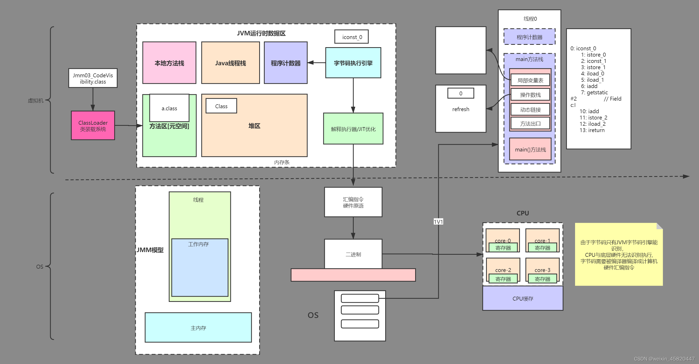
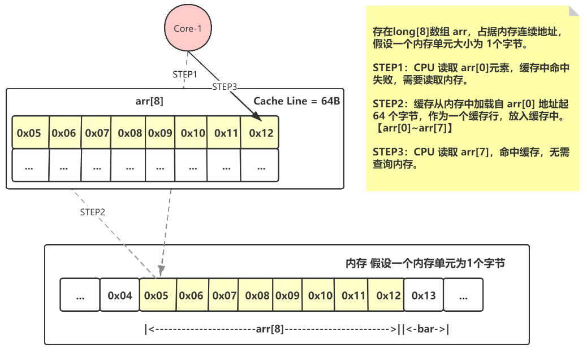
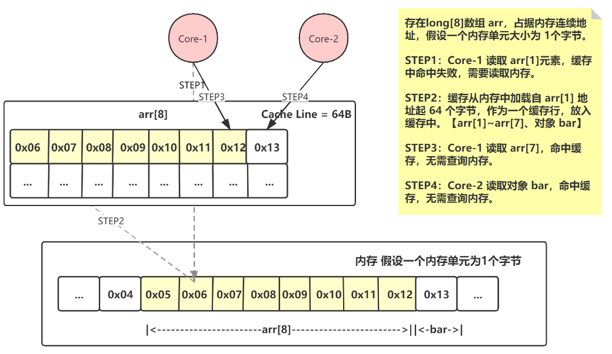

### 伪共享

两个毫无关联的线程执行，一个线程却因为另一个线程的操作，导致缓存失效。这两个线程其实就是对同一缓存行产生了竞争，降低了并发性

程序运行时会将数据加载到缓存中，一个缓存行一般64位，可以加载8个long类型数据，假设程序正在使用第2个数据，这时第5个数据改动，根据mesi协议会导致这8个缓存数据全部失效。


### 前置了解

- cpu架构
- java内存模型，MESI
- java字节码执行



### 产生原因

1. cpu执行指令时会将数据加载到高速缓存
2. 多核cpu高速缓存在多线程情况下，遵循MESI协议
3. 高速缓存最小单位为缓存行64字节

4. java编译字节码时 变量加载顺序根据定义顺序和自继承顺序 

### ArrayBlockingQueue 和 disruptor

### 缓存行与伪共享

cpu在进行计算时需要从内存中加载数据，一般加载的最小单位是一个缓存行，即64字节，由此可能会加载到其他字段数据。

以 Java 的 long 类型为例，它是 8 个字节，假设我们存在一个长度为 8 的 long 数组 arr，那么CPU 在读取 arr[0] 时，首先查询缓存，缓存没有命中，缓存就会去内存中加载。由于缓存的最小存储单位是缓存行，64 字节，且数组的内存地址是连续的，则将 arr[0] 到 arr[7] 加载到缓存中。后续 CPU 查询 arr[6] 时候也可以直接命中缓存。



现在假设多线程情况下，线程 A 的执行者 CPU Core-1 读取 arr[1]，首先查询缓存，缓存没有命中，缓存就会去内存中加载。从内存中读取 arr[1] 起的连续的 64 个字节地址到缓存中，组成缓存行。由于从arr[1] 起，arr 的长度不足够 64 个字节，只够 56 个字节。假设最后 8 个字节内存地址上存储的是对象 bar，那么对象 bar 也会被一起加载到缓存行中。



现在有另一个线程 B，线程 B 的执行者 CPU Core-2 去读取对象 bar，首先查询缓存，发现命中了，因为 Core-1 在读取 arr 数组的时候也顺带着把 bar 加载到了缓存中。

这就是缓存行共享。  
假设 Core-1 想要更新 arr[7] 的值，根据 CPU 的 MESI 协议，那么它所属的缓存行就会被标记为失效。因为它需要告诉其他的 Core，这个 arr[7] 的值已经被更新了，缓存已经不再准确了，你必须得重新去内存拉取。但是由于缓存的最小单元是缓存行，因此只能把 arr[7] 所在的一整行给标识为失效。

此时 Core-2 就会很郁闷了，刚刚还能够从缓存中读取到对象 bar，现在再读取却被告知缓存行失效，必须得去内存重新拉取，延缓了 Core-2 的执行效率。

这就是缓存伪共享问题，两个毫无关联的线程执行，一个线程却因为另一个线程的操作，导致缓存失效。这两个线程其实就是对同一缓存行产生了竞争，降低了并发性。


### 解决方案

disruptor 采用以时间换空间方法，通过填充的无用字段的方法，消除伪共享，Sequence，RingBuffer都是用次方案

 Disruptor 中的 Sequence 为例，在 volatile long value 的前后各放置了 7 个 long 型变量，确保 value 独占一个缓存行。

```
class LhsPadding {
    protected long p1, p2, p3, p4, p5, p6, p7;
}

class Value extends LhsPadding {
    protected volatile long value;
}

class RhsPadding extends Value {
    protected long p9, p10, p11, p12, p13, p14, p15;
}

public class Sequence extends RhsPadding {
    private static final long VALUE_OFFSET;
    
    static {
        VALUE_OFFSET = UNSAFE.objectFieldOffset(Value.class.getDeclaredField("value"));
        ...
    }
    ...
}
```

如下图所示，其中 V 就是 Value 类的 value，P 为 value 前后填充的无意义 long 型变量，U 为其它无关的变量。不论什么情况下，都能保证 V 不和其他无关的变量处于同一缓存行中，这样 V 就不会被其他无关的变量所影响。


这里的 V 也不限定为 long 类型，其实只要对象的大小大于等于8个字节，通过前后各填充 7 个 long 型变量，就一定能够保证独占缓存行。

此处以 Disruptor 的 RingBuffer 为例，最左边的 7 个 long 型变量被定义在顶级父类 RingBufferPad 中，最右边的 7 个 long 型变量被定义在 RingBuffer 的最后一行变量定义中，这样所有的需要独占的变量都被左右 long 型给包围，确保会独占缓存行。
```
abstract class RingBufferPad {
    protected long p1, p2, p3, p4, p5, p6, p7;
}

abstract class RingBufferFields<E> extends RingBufferPad
{
    ...
}


public final class RingBuffer<E> extends RingBufferFields<E> implements Cursored, EventSequencer<E>, EventSink<E> {
    public static final long INITIAL_CURSOR_VALUE = Sequence.INITIAL_VALUE;
    protected long p1, p2, p3, p4, p5, p6, p7;
    ...
}

```

### 参考

[高性能 Disruptor——消除伪共享](https://blog.csdn.net/yuanlaijike/article/details/105611879)

[Java专家系列：CPU Cache与高性能编程](https://blog.csdn.net/karamos/article/details/80126704)


