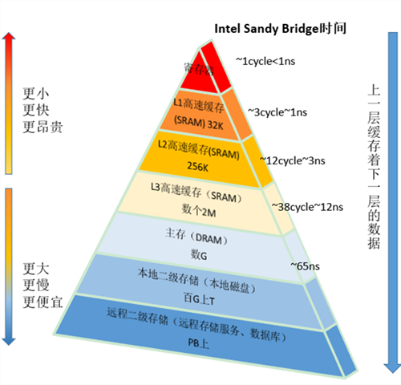

### 伪共享

两个毫无关联的线程执行，一个线程却因为另一个线程的操作，导致缓存失效。这两个线程其实就是对同一缓存行产生了竞争，降低了并发性

程序运行时会将数据加载到缓存中，一个缓存行一般64位，可以加载8个long类型数据，假设程序正在使用第2个数据，这时第5个数据改动，根据mesi协议会导致这8个缓存数据全部失效。

### 原理

cpu频率不断提高,但内存访问速度没有提升，为了发挥cpu计算资源，提交cpu整体吞吐量，相继在cpu与内存之间引入高速缓存一级Cache L1，二级Cache L2，甚至三级Cache L3

一个处理器对应一个插槽，多个插槽间通过QPI最线相连，一个处理器包含多个核，一个处理器间的多核共享L3 Cache。一个核包含寄存器、L1 Cache、L2 Cache

### 参考

https://blog.csdn.net/karamos/article/details/80126704

