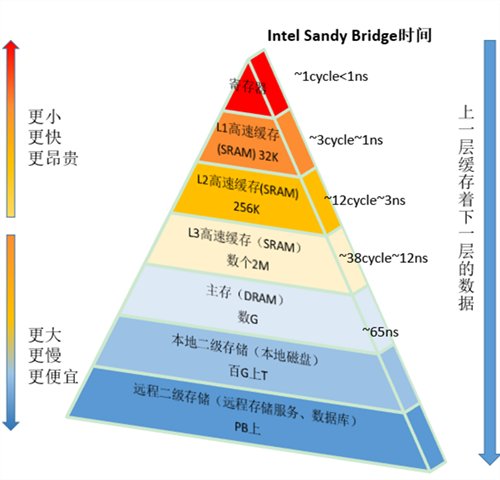
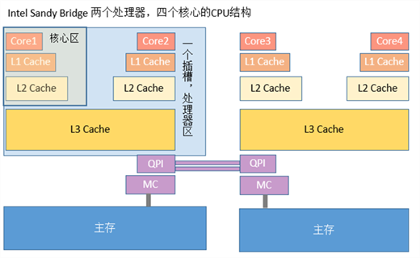

cpu频率不断提高,但内存访问速度没有提升，为了发挥cpu计算资源，提交cpu整体吞吐量，相继在cpu与内存之间引入高速缓存一级Cache L1，二级Cache L2，甚至三级Cache L3

一个处理器对应一个插槽，多个插槽间通过QPI最线相连，一个处理器包含多个核，一个处理器间的多核共享L3 Cache。一个核包含寄存器、L1 Cache、L2 Cache

缓存最小处理单位为缓存行，一个缓存行大多是64字节