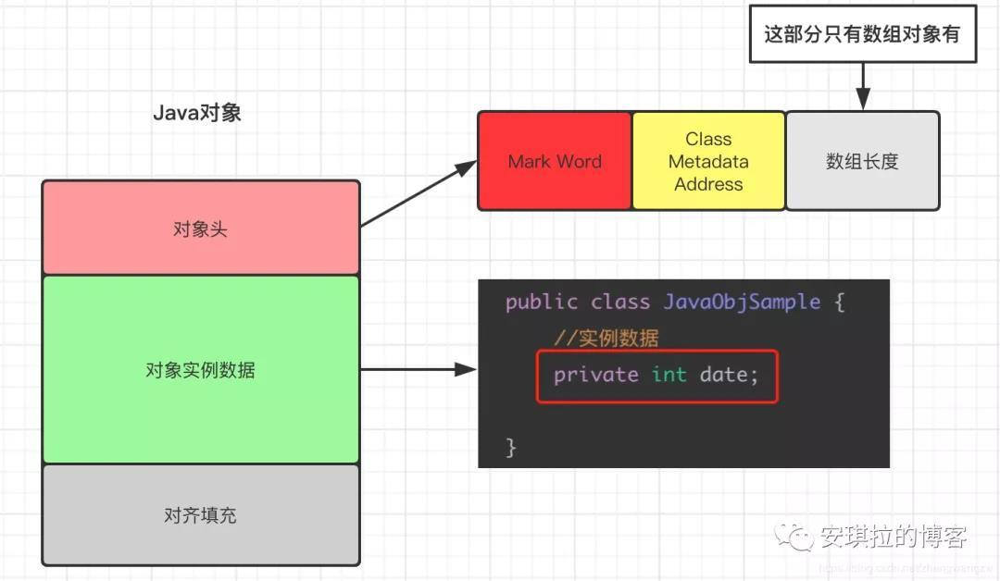
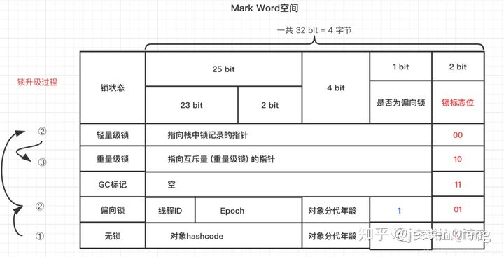
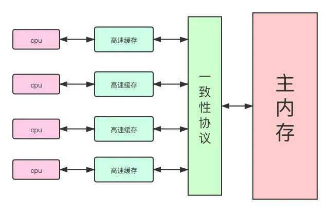

### 对象

如下图，对象被jvm加载到内存如下结构，包含对象头，对象实例数据，最后为填充对其。

- 对象头会包含MarkWord，元数据等信息

- 对象实例数据包含变量及方法

编译器生成的class文件主要对定义在源文件中的类:
1) 先按照静态成员变量的定义次序在类内部声明成员变量.
2) 再按照原java类中对成员变量的初始化次序进行初始化.

同一个对象的变量会依次被jvm加载到内存

### JMM java内存模型

主内存，每个cpu通过高速缓存获取数据，当缓存数据有变化时，会导致高速缓存中的缓存行失效

