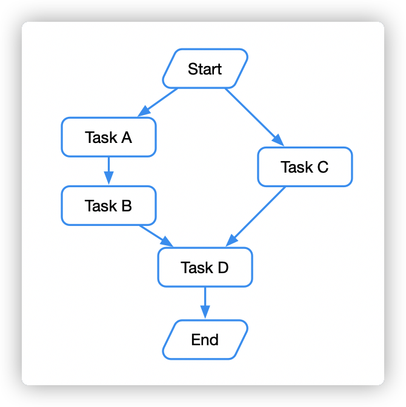
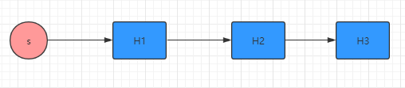
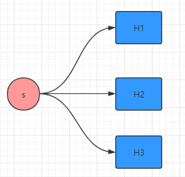
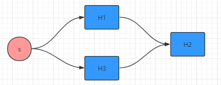
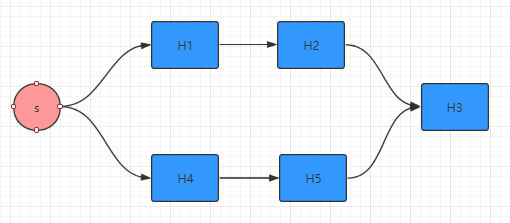
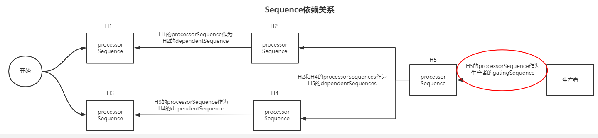

## 链路

disruptor可以多种链路处理

为支持需要按照特定顺序发生的阶段性类似流水线事件。

遵循single-writer原则实现零竞争，也可以用多线程读取数据

可构造多种结构处理链路，主要是通过结合消费者之间及生产者与消费者之间sequence构建链路关系

类似DAG
可以构造有向无环图

## 注意点

- 生产者总是要把RingBuffer填充完一圈后才会考虑追赶消费者进度的问题；
- 线程池需要保证足够的线程：有多少个消费者就要有多少个线程，否则有些消费者将不会执行（消费者线程起不来），生产者生产完一圈RingBuffer后即使有新的数据生产者也会一直阻塞下去;
- 消费者执行链中，每个消费者都是独立的消费线程，决定当前消费者消不消费的只有其依赖的消费者有无消费完，消费者进行消费第二个数据时无须等整个执行链执行完才能消费。比如有执行链：A->B-C，生产者在Ringbuffer中生产了2个数据，那么消费顺序可能为A->B->C->A->B-C，也可能为A->B-A->B->C->C,也可能为A->A->B->B->C->C等。
- 生产者填充完第一圈Ringbuffer后，当要追赶消费者消费速度时，此时生产者能否继续生产取决于执行链最后一个消费者的消费速度。比如有执行链：A->B-C，生产者的生产速度取决于消费者C的消费速度。

## 链路种类

- 串行
    
- 并行  
    
- 菱形  
    
- 多边形  
    

## EventProcessor

## BatchEventprocesor
    
    多线程并发处理,不同线程执行不同是不同的event
    每个消费者对应线程，被封装到consumerInfo中，disruptor启动时，实际上是将每个consumerInfo启动

    WaitStrategy在没有生产者生产数据时，会阻塞。当发布数据时候，所有的consumerInfo会接收到notify

## gateSequences

描述生产者喝消费者之间。标识消费者进度

## ConsumerRepository

多个WorkHandler被封装到一个WorkerPool中，之后该WorkerPool被放入到consumerRepository中，进而放入到ConsumerRepository的eventProcessorInfoBySequence、consumerInfos。

提供存储机制，关联EventHandlers和EventProcessors
两个维度关联信息，创建customerInfo：

## barrierSequences

barrierSequences是给存在依赖关系的消费者用的。
如果执行顺序为A->B,那么barrierSequences是A消费者的sequence。如果A,C->B,那么barrierSequences是A和C消费者的sequence。
最终创建的即是： ProcessingSequenceBarrier

## sequence关系

将链路最后消费者sequence当做是生产者的barrierSequence,保证生产者永远在消费者后面

消费者与消费者之间dependentSequence

## 参考
[disrutpor链路实战](https://www.cnblogs.com/gyli20170901/p/10249929.html)
[Disruptor广播模式与执行顺序链源码分析](https://blog.csdn.net/biaolianlao0449/article/details/123964943)